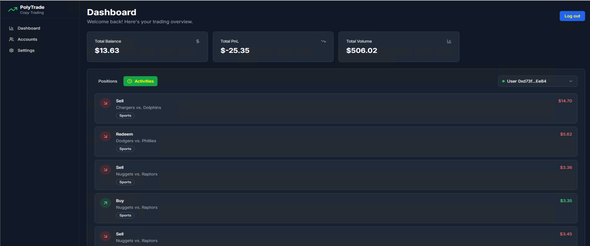
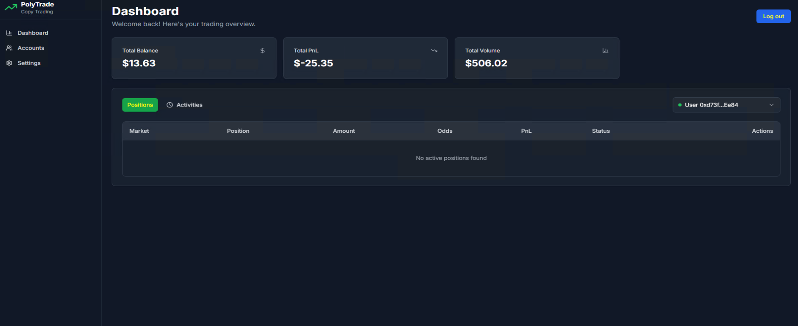
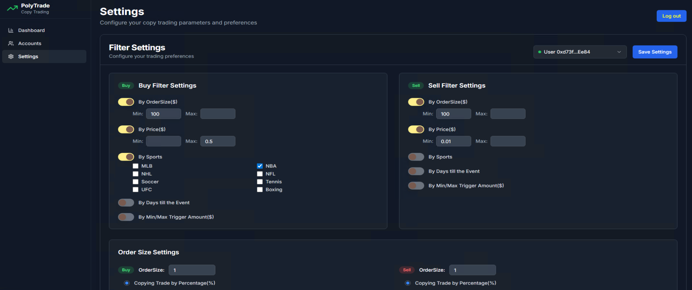

# Polymarket Copy Trading Bot & Platform

A production-focused copy trading system for Polymarket that lets users mirror trades from selected leader accounts, manage risk, and visualize performance. This repository documents the prediction platform workflow, platform architecture, and how the frontend and backend fit together. It also includes product screenshots and workflow images for clarity.

## Table of Contents
- Overview
- Features
- Architecture
- Frontend (App/UI)
- Backend (API/Workers)
- Copy Trading Workflow
- Configuration & Environment
- Security & Compliance
- Roadmap
- Screenshots & Workflow
- Contact

## Overview
Polymarket Copy Trading enables followers to automatically mirror the trades of curated leader wallets on Polymarket. The platform abstracts leader discovery, risk controls, allocation strategies, and execution reliability.

## Features
- Leader selection and portfolio mirroring
- Allocation controls (fixed, proportional, caps)
- Risk management (max exposure, per-market limits)
- Execution engine with queue/retry and idempotency
- Performance analytics and dashboards
- API-first design for integrations
- Admin tools for monitoring

## Architecture
High-level components:
- Frontend: Web client for onboarding, configuration, analytics, and admin
- Backend API: REST/GraphQL endpoints, auth, validation, persistence
- Worker/Executor: Trade replication, scheduling, backoff, and reconciliation
- Data layer: Persistence (users, leaders, positions, fills, analytics)
- Integrations: Polymarket APIs, on-chain oracles/providers as applicable

A typical flow:
1) User configures copy rules on the frontend
2) Backend stores rules and schedules jobs
3) Worker listens for leader signals and replicates trades
4) Results and portfolio state are reflected back to the UI

## Frontend (App/UI)
Responsibilities:
- Authentication and account linking
- Leader discovery and selection
- Copy configuration (allocations, caps, risk)
- Portfolio, PnL, and market views
- Admin/ops dashboards

Suggested implementation guidelines:
- Use a modern SPA framework (e.g., Next) with component/state best practices
- Type-safe API client, schema validation at the boundary
- Error boundaries, optimistic UI for settings, graceful fallbacks
- Keep secrets in `.env.local`, never commit keys

## Backend (API/Workers)
Responsibilities:
- Auth, user & leader management
- Copy rules and validation
- Trade replication API and job orchestration
- Rate limiting, retries, and idempotency
- Webhooks and event ingestion
- Observability (logs, metrics, traces)

Suggested implementation guidelines:
- Strong input validation at every public endpoint
- Clear separation: API layer, domain/services, data access
- Job queue for execution (delayed, retry, dead-letter)
- Idempotency keys to avoid duplicate fills
- Configurable rate limits and backpressure
- Structured logging and tracing for debugability

## Copy Trading Workflow
At a glance:
- Discover: Curate leader wallets and expose metadata in the UI
- Configure: Follower sets allocation and risk parameters
- Observe: Worker listens for leader trades/events
- Replicate: Create follower orders with allocation and risk constraints
- Reconcile: Confirm fills, update portfolio, and log outcomes
- Analyze: Show performance, exposure, and history in the dashboard

## Security & Compliance
- Enforce auth and authorization at the API boundary
- Validate every input and external response
- Apply idempotency keys to mutation endpoints
- Implement rate limits and circuit breakers for external calls
- Encrypt secrets at rest and in transit
- Provide audit logs for critical actions

## Roadmap
- Leader discovery enhancements and ranking
- Advanced allocation strategies
- Automated risk scoring for markets
- Expanded analytics and alerting
- Self-serve billing/subscriptions

## Screenshots & Workflow
Below are included assets. Paths are relative to this folder.

.webp)

## Contact
- Email: codex199201@gmail.com
- Telegram: jupiter117